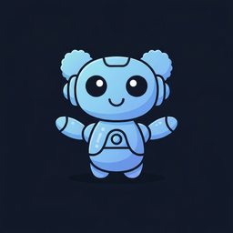

# LittleLLM v1.9.0 🤖💬

A powerful, lightweight desktop chat application for Windows that provides seamless access to multiple AI providers with advanced features like MCP (Model Context Protocol) integration, tool calling, memory context, and enhanced vision support.



## ✨ Features

### 🚀 **Multi-Provider Support**
- **OpenAI**: GPT-4o, GPT-4-turbo, GPT-3.5-turbo, O1-preview, O1-mini ✅
- **Anthropic**: Claude 4 Sonnet/Opus, Claude 3.5 Sonnet, Claude 3 Opus/Sonnet/Haiku ✅
- **Google Gemini**: Gemini 2.5 Flash/Pro, Gemini 1.5 Pro/Flash ✅
- **Mistral AI**: Mistral Large, Medium, Small, Codestral ✅
- **DeepSeek**: DeepSeek Chat, DeepSeek Coder ✅
- **LM Studio**: Local server for any GGUF model (free) ✅
- **Ollama**: Local models support with enhanced vision capabilities ✅
- **OpenRouter**: 150+ models from multiple providers ✅
- **Requesty**: 80+ models with smart routing ✅
- **Replicate**: Cloud-hosted models ✅
- **n8n**: Custom workflow integration with multipart form data support ✅

> **All 11 providers fully implemented with streaming support, vision capabilities, and tool calling integration**

### 🖼️ **Vision Support**
- Send images directly to vision-capable models
- Automatic image optimization (resize + compression)
- Supports screenshots, photos, and documents
- OpenRouter vision API integration

### ⚡ **Quick Access**
- Global keyboard shortcut (Ctrl+Shift+L)
- **Prompts Menu**: Ctrl+Shift+Space or click prompts button 🪄
- **Draggable Overlays**: Move settings and prompts windows anywhere
- Floating window that stays on top
- Minimizes to system tray
- Auto-resize chat input (1-10 lines)
- ESC key to close window

### 🛠️ **Advanced Features**
- **MCP (Model Context Protocol) Integration**: Full support for MCP servers and tools ✨
- **Tool Calling**: User-controlled tool execution with native provider support ✨
- **Memory Context**: Intelligent conversation memory with automatic context retrieval ✨
- **Model Persistence**: Each provider remembers your last selected model across restarts
- **Thinking Sections**: Collapsible display of model reasoning for `<think>` tags
- **Clipboard Integration**: Prompts automatically include clipboard content via `{content}` placeholder
- **Copy Functionality**: One-click copy for entire messages + text selection for partial copying
- **Stop/Cancel**: Interrupt hanging requests
- **Provider-specific settings**: Separate API keys per provider
- **Temperature control**: Adjust model creativity
- **Token limits**: Prevent runaway generation
- **System prompts**: Customize AI behavior
- **Dark mode**: Multiple themes available
- **Token Tracking**: Real-time tokens/second and total usage display ✨
- **Enhanced Response Parsing**: Automatic cleanup of structured responses ✨

### 📁 **File Support**
- **Images**: PNG, JPG, GIF, WebP
- **Documents**: Text files, PDFs
- **Clipboard**: Paste images and text
- **Drag & drop**: Easy file attachment

## 🚀 Quick Start

### Download & Install

**Windows Installer (Recommended)**
1. Download `LittleLLM-Setup-1.9.0.exe` from [Releases](https://github.com/NickPittas/littlellm/releases)
2. Run the installer (may need "Run as administrator")
3. Follow installation wizard
4. Launch from Desktop shortcut or Start Menu

**Portable Version**
1. Download `LittleLLM-Portable-1.9.0.exe` from [Releases](https://github.com/NickPittas/littlellm/releases)
2. Place anywhere (Desktop, USB drive, etc.)
3. Double-click to run - no installation needed

> **✅ Latest builds include all 11 AI providers with MCP integration, tool calling, and enhanced vision support**

📖 **[Full Installation Guide](INSTALLATION.md)**

### Setup API Keys
1. Click the settings icon ⚙️
2. Select your preferred provider
3. Enter your API key:
   - **OpenAI**: Get from [platform.openai.com](https://platform.openai.com)
   - **Anthropic**: Get from [console.anthropic.com](https://console.anthropic.com)
   - **Google Gemini**: Get from [aistudio.google.com](https://aistudio.google.com)
   - **Mistral AI**: Get from [console.mistral.ai](https://console.mistral.ai)
   - **DeepSeek**: Get from [platform.deepseek.com](https://platform.deepseek.com)
   - **OpenRouter**: Get from [openrouter.ai](https://openrouter.ai)
   - **Requesty**: Get from [app.requesty.ai](https://app.requesty.ai)
   - **LM Studio**: No API key needed (local server)
   - **Ollama**: No API key needed (local models)

### Start Chatting
1. Press **Ctrl+Shift+L** to open the chat window
2. Select a provider and model from the bottom dropdowns
3. Type your message and press Enter
4. Attach images by clicking the paperclip icon or pasting from clipboard
5. Use **Ctrl+Shift+Space** to access quick actions and prompts
6. Toggle tool calling with the 🔧 button next to attachments
7. Manage MCP servers with the 🖥️ dropdown
8. Copy text from clipboard, then select prompts with `{content}` for automatic insertion

## 🔧 Development

### Prerequisites
- Node.js 18+
- npm or yarn

### Setup
```bash
git clone https://github.com/yourusername/littlellm.git
cd littlellm
npm install
```

### Development Mode
```bash
# Start Next.js dev server
npm run dev

# Start Electron in dev mode
npm run electron-dev
```

### Build Executable
```bash
# Build for current platform
npm run dist

# Build for specific platforms
npm run dist:win    # Windows
npm run dist:mac    # macOS
npm run dist:linux  # Linux
```

## 📋 Keyboard Shortcuts

| Shortcut | Action |
|----------|--------|
| `Ctrl+Shift+L` | Open/Show LittleLLM |
| `Ctrl+Shift+Space` | Open Action Menu |
| `Ctrl+Shift+V` | Process Clipboard |
| `Esc` | Close window |
| `Enter` | Send message |
| `Shift+Enter` | New line in chat input |
| `Ctrl+V` | Paste (including images) |
| `Ctrl+R` | Reset chat conversation |

## 🎨 Themes

LittleLLM supports 20+ themes including:
- Dark mode (default)
- Light mode
- High contrast
- Custom color schemes

## 🔒 Privacy & Security

- **Local storage**: All settings stored locally
- **No telemetry**: No usage data collected
- **API keys**: Stored securely in encrypted local storage
- **Open source**: Full source code available

## 🐛 Troubleshooting

### Common Issues

**App won't start**
- Check if port 3000 is available
- Try running as administrator

**API errors**
- Verify API key is correct
- Check internet connection
- Ensure sufficient API credits

**Models not loading**
- Check API key permissions
- Try refreshing the model list
- Use fallback models if API is down

### Support
- Create an issue on [GitHub](https://github.com/NickPittas/littlellm/issues)
- Check existing issues for solutions

## 🔧 Development

### Prerequisites
- Node.js 18+
- npm or yarn

### Setup
```bash
# Clone the repository
git clone https://github.com/NickPittas/littlellm.git
cd littlellm

# Install dependencies
npm install

# Start development server
npm run dev

# In another terminal, start Electron
npm run electron-dev
```

### Building
```bash
# Build for production
npm run build

# Build both installer and portable (Windows)
npm run build:windows

# Build specific versions
npm run dist:win-installer  # Windows installer (.exe)
npm run dist:win-portable   # Windows portable (.exe)
npm run dist:mac            # macOS (.dmg)
npm run dist:linux          # Linux (AppImage)
```

## 🆕 What's New in v1.9.0

### 🔧 **Major Bug Fixes**
- **Fixed Chat Window Visibility**: Resolved issues with global shortcuts not properly restoring chat windows
- **Enhanced Window State Management**: Improved tracking and restoration of window visibility states
- **Reliable Open Chat Button**: Button now works unconditionally regardless of previous hide/show cycles

### 🎯 **MCP (Model Context Protocol) Integration** ✨
- **Full MCP SDK Integration**: Complete implementation of Model Context Protocol
- **Server Management**: Add, configure, and manage MCP servers through UI
- **Tool Discovery**: Automatic detection and formatting of available MCP tools
- **Per-Chat Control**: Enable/disable MCP servers per conversation
- **Security Architecture**: MCP SDK isolated in main process with IPC bridge

### 🛠️ **Tool Calling System** ✨
- **User-Controlled Tool Calling**: Toggle switch next to attachment buttons
- **Native Tool Support**: Works with models that natively support structured tool calling
- **Streaming Tool Assembly**: Assembles tool calls from streaming chunks
- **Clean Follow-up Processing**: Tool results processed without system message pollution

### 🧠 **Memory Context System** ✨
- **Intelligent Memory**: Automatic conversation memory with context retrieval
- **Memory Tools**: Built-in memory management tools for storing and retrieving information
- **Context-Aware Responses**: AI responses enhanced with relevant memory context

### 🖼️ **Enhanced Vision Support** ✨
- **Fixed Ollama Vision**: Proper pattern matching and native API integration for vision models
- **Multipart Form Data**: n8n provider sends images as proper binary attachments
- **Response Parser**: Advanced parsing system for cleaning up structured responses
- **No Image Conversion**: Direct base64 handling for all providers (optimized performance)

### 🎨 **UI/UX Improvements** ✨
- **Token Tracking**: Real-time tokens/second and total usage display
- **Reset Chat**: One-click conversation clearing with 🔄 button
- **MCP Dropdown**: Bottom toolbar control for MCP server management
- **Enhanced Settings**: Dedicated MCP configuration section with raw JSON editor
- **Tool Call Indicators**: Visual feedback when tools are being executed

### 🔧 **Technical Improvements**
- **Enhanced Logging**: Comprehensive debug output for settings and MCP operations
- **Better Error Handling**: Improved error messages and fallback mechanisms
- **Performance Optimizations**: Reduced image processing overhead
- **Type Safety**: Improved TypeScript definitions throughout the codebase

## 🏗️ **Tech Stack**
- **Frontend**: Next.js 14, React 18, TypeScript
- **Desktop**: Electron 37.1.0
- **Styling**: Tailwind CSS, Radix UI components
- **Build**: Electron Builder for cross-platform distribution
- **MCP Integration**: @modelcontextprotocol/sdk v1.15.1
- **Testing**: Vitest with comprehensive test coverage

## 📄 License

MIT License - see [LICENSE](LICENSE) file for details.

## 🙏 Acknowledgments

- Built with [Next.js](https://nextjs.org/) and [Electron](https://electronjs.org/)
- UI components from [Radix UI](https://radix-ui.com/)
- Icons from [Lucide](https://lucide.dev/)
- Styling with [Tailwind CSS](https://tailwindcss.com/)

---

**LittleLLM v1.9.0** - Your intelligent AI companion with MCP integration, tool calling, and memory context 🚀

## 📦 **Production Builds**
- **Windows Installer**: `LittleLLM-Setup-1.9.0.exe` with proper installation
- **Portable Version**: `LittleLLM-Portable-1.9.0.exe` for USB/standalone use
- **No CORS Issues**: All APIs work perfectly in the executable builds
- **Enhanced Features**: MCP integration, tool calling, and memory context included
